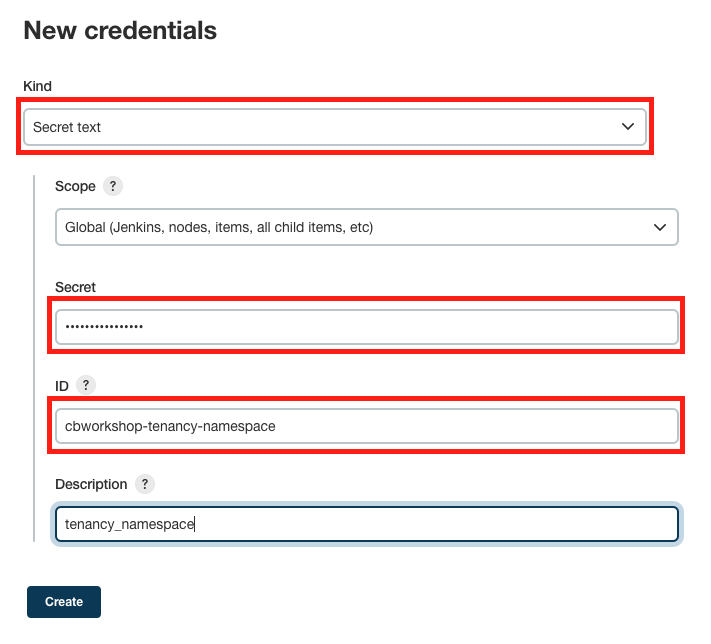
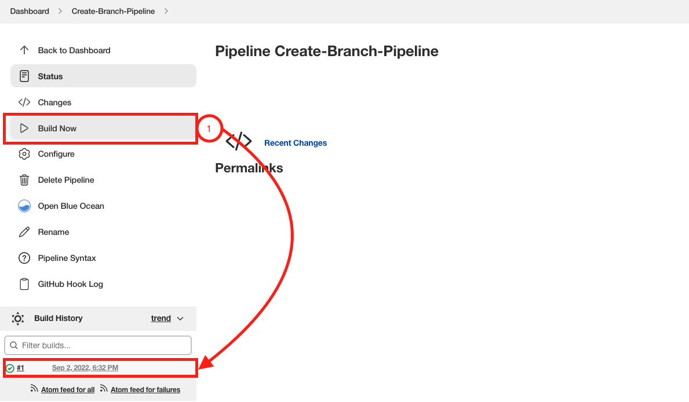
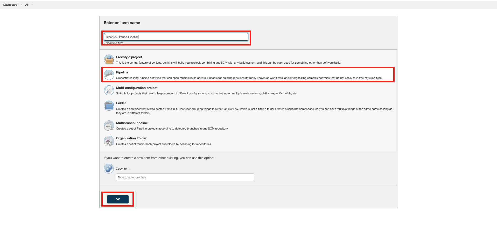
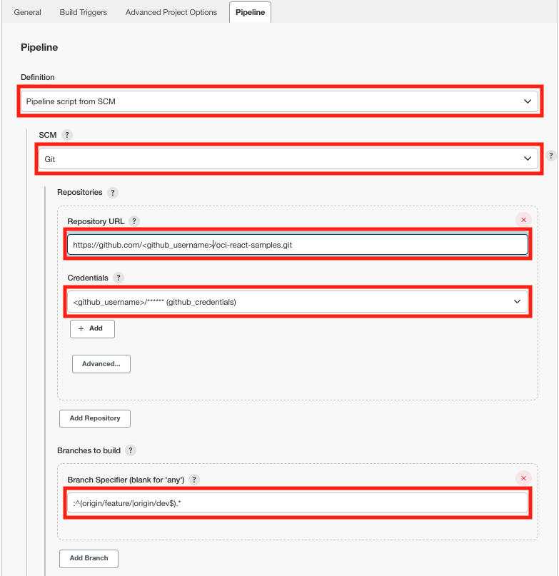
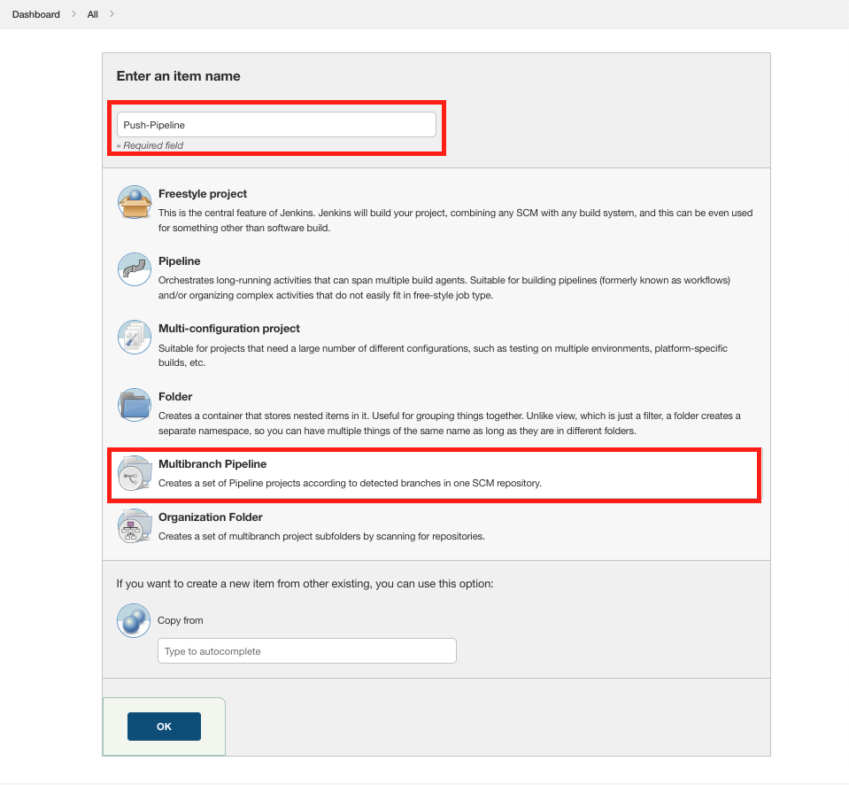
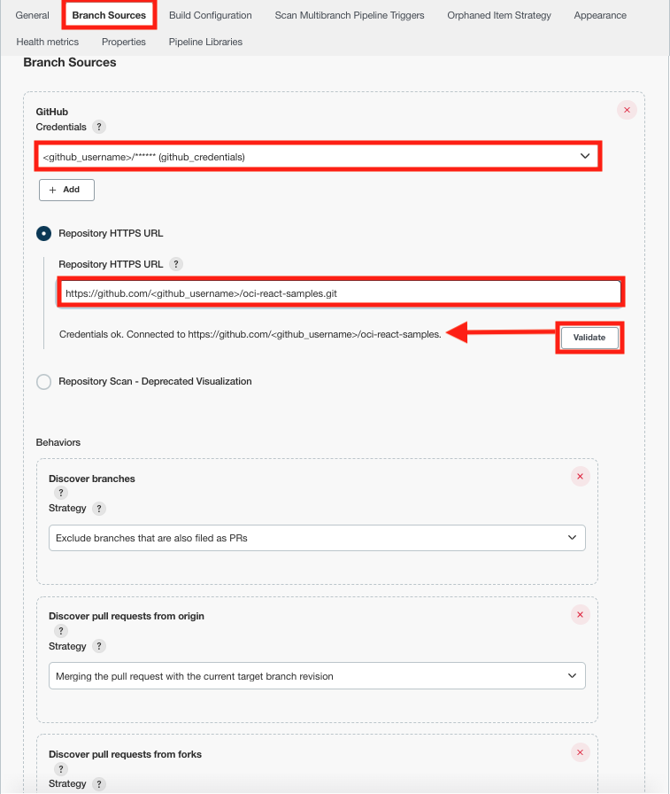
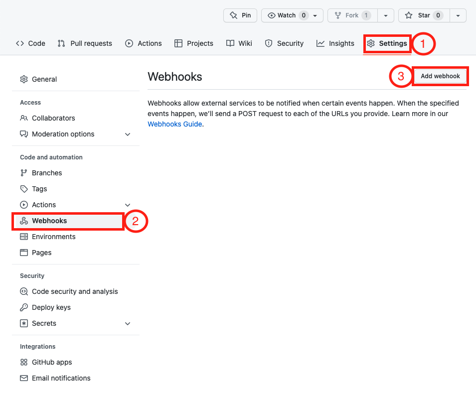
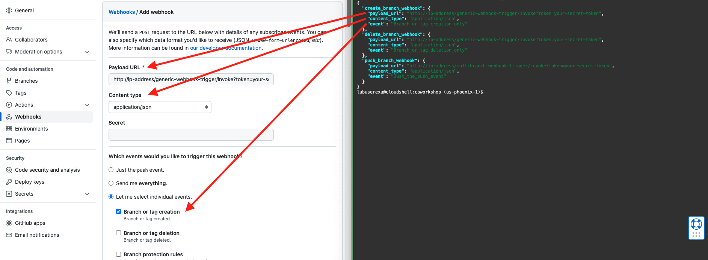

#  Preparing Jenkins and Configuring Webhooks

## Introduction

For this lab, you will create multiple pipelines in Jenkins that will run jobs for different scenarios. Currently, you have a working environment from Lab 3, the previous lab. You can call this environment your TEST environment, where your QA team can test all features, bugs and updates developed and fixed after a sprint and for review before merging to master and tagging. You will also have a DEV branch containing all completed features and fixes that the team worked on. For those features and fixes, you will be creating and committing those changes into feature branches which will create and provide an isolated, shared and easily-replaceable environment (currently only a database to demonstrate usage of the Oracle Database operator for Kubernetes). Once DEV is ready, you will create a `release-1.0` branch that will trigger an update to the TEST environment.

Do note that this setup of Jenkins is NOT built for production purposes and is setup minimally.

Estimated Time: 15 minutes

### Objectives

* Configure Jenkins Pipelines
* Configure GitHub webhooks
  
### Prerequisites

* Lab-Related resources provisioned
* Working OKE cluster

## Task 1: Generate a GitHub Access Token

To authorize access to your repository, Jenkins credentials must be made with your GitHub credentials. It is highly recommended to generate a restrictive Personal Access Token, with which you can control how much access and for how long you want to provide access.

1. On your GitHub account, click on your profile at the top right and select `Settings`.

    

2. From here, scroll down and go to `Developer Settings` on the left

    

3. Under Developer Settings, navigate to `Personal access tokens`, and click on `Generate new token`

    

4. In creating a new personal access token, you can add a Note to help you remember what the token is for. For example, you can set:
    
    ```
    <copy>
    repo-access-only
    </copy>
    ```
5. Under `Select scopes`, Select `repo`
    
    ```
    repo - Full control of private repositories
    ```

    

6. At the bottom of the page, click `Generate token` to complete the step and generate the token

    > **Note:** Copy and keep your GitHub Access Token in your notes.

## Task 2: Configure Jenkins Credentials
You will need to create some credentials in Jenkins to authorize access to both our Kubernetes cluster and GitHub, as well as webhook tokens.

To access the Jenkins Console, you will need to retrieve the IP address to visit on your browser. 

1. Run the following on __Cloud Shell__. This command retrieves the IP address from Terraform as one of the outputs

    ```bash
    <copy>
    terraform -chdir="$CB_STATE_DIR/terraform" output -json | jq -r .jenkins_public_ip.value
    </copy>
    ```

2. Login as `admin` with the `Jenkins password` you supplied earlier.
   
    Retrieve the password from your notes, which you provided during setup.

    

3. Navigate to the Jenkins credentials store to create credentials

    1. From the home page, click on Manage Jenkins
    2. From the Manage Jenkins page, Under Security, go to Manage Credentials
    3. Hover over (global), the domain for the Jenkins Store (under Stores scoped to Jenkins)
    4. Click on the dropdown
    5. Click on Add credentials

    
    
    

4. On __Cloud Shell__, run the following command to get a list of the credentials that need to be created. 

    ```bash
    <copy>
    ( cd $CB_STATE_DIR/tasks ; ./generate-configuration-help.sh )
    </copy>
    ```
    
    This script will collect information together for you when creating credentials on Jenkins. Run the following command to retrieve this information:

    ```bash
    <copy>
    state_get .lab.credentials
    </copy>
    ``` 
    
    This command will produce an output similar to the following snippet below. 
    
    ```json
    {
    ...
    "tenancy_namespace": {
       "kind": "secret_text",
       "secret": "<tenancy-namespace>",
       "id": "cbworkshop-tenancy-namespace"
    }
    ...
    ```

    In the snippet, you will see 3-4 keys and their values which map to what you should enter on Jenkins. For example, when creating the credentials for `create_branch_webhook` above:
      
      1. Set Kind to `Secret Text`
      2. Copy and Paste the secret inside the field, Secret
      3. Copy and Paste the id inside the field, ID.
      4. (Optional) Set the parent key of the object as the description
    
    

5. Create the following credentials:
   
      1. create\_branch\_webhook
      2. delete\_branch\_webhook
      3. push\_branch\_webhook
      4. tenancy\_namespace
      5. region\_key
      6. cluster\_name
      7. cluster\_server\_url
      8. cluster\_token
      9. db\_password
      10. lab\_unique\_id
      11. github\_credentials
      12. ocir\_credentials

## Task 3: Configure the Create-Branch Pipeline
Once you have created the credentials, you can move on to create the Jenkins pipelines that will be triggered on different parts of the DevOps workflow.

This first pipeline will be responsible for creating isolated environments for feature development. In this part of the lab, you will provision and setup a Single Instance Database with scripts to initialize schemas and queues through the Kubernetes operator.

1. Create a new Pipeline by clicking on `+ New Item`

    

2. Enter an item name: `Create-Branch-Pipeline`
3. Select `Pipeline`
4. Click `OK`

    

5. Under Build Triggers, select `GitHub hook trigger for GITScm polling`
6. Under Pipeline, select `Pipeline script from SCM`
7. Under Pipeline > SCM, set `Git`
8. Set the Repository HTTPS URL to your Fork's HTTPS URL
9.  Set the Credentials to your GitHub credentials created earlier, which should appear as `<github-username>/******`
10. Under Branch Specifier, change `*/master`  to 

    ```bash
    <copy>
    :^(origin/feature/|origin/release/|origin/dev$).*
    </copy>
    ```

    This will limit the pipeline to building only the branches specified above.

    

11. For Build Configuration, set the Script Path to the location of the Jenkinsfile in the lab repository:

    ```bash
    <copy>
    cloudbank/jenkins/create-dev-env/Jenkinsfile
    </copy>
    ```

12. Click `Save`

    With the pipeline configured, build the pipeline initially to enable Jenkins to register all pipeline parameters and settings. Once you press Save, Jenkins will navigate automatically to that specific pipeline.

13. Click on `Build Now`

    The Pipeline should **succeed** with a checkmark.

    

## Task 4: Configure the Delete-Branch Pipeline

This second pipeline will be responsible for tearing down your isolated environments when you no longer need them after merging your feature back to the cloudbank branch (test).

1. Create a new Pipeline by clicking on `+ New Item`
2. Enter an item name: `Cleanup-Branch-Pipeline`
3. Select `Pipeline`
4. Click `OK`

      

5. Under Build Triggers, select `GitHub hook trigger for GITScm polling`
6. Under Pipeline, select `Pipeline script from SCM`
7. Under Pipeline > SCM, set `Git`
8. Set the Repository HTTPS URL to your Fork's HTTPS URL
9.  Set the Credentials to your GitHub credentials created earlier, which should appear as `<github-username>/******`
10. Under Branch Specifier, change `*/master` to
    
      ```bash
      <copy>
      :^(origin/feature/|origin/dev$).*
      </copy>
      ```

      

11. For Build Configuration, set the Script Path to the location of the Jenkinsfile in the lab repository:
    
    ```bash
    <copy>
    cloudbank/jenkins/destroy-dev-env/Jenkinsfile
    </copy>
    ```
12. Click `Save`
13. Click on `Build Now`

    The Pipeline should **succeed** with a checkmark.

## Task 5: Configure the Push-Branch Pipeline
This third pipeline will build the applications on push to dev and feature-branches.

1. Create a new Pipeline by clicking on `+ New Item`
2. Enter an item name: `Push-Pipeline`
3. Select `Multibranch Pipeline`
4. Click `OK`

    

5. Under Branch Source, `Add source`, select `GitHub`
6. Set Credentials to your GitHub credentials
7. Set Repository HTTPS URL
8. Validate by clicking on `Validate` below the Repository HTTPs URL

    

9.  For Build Configuration, set the Script Path to the location of the Jenkinsfile in the lab repository:
   
    ```bash
    <copy>
    cloudbank/jenkins/push/Jenkinsfile
    </copy>
    ```

10. Under Scan Multribranch Pipeline Triggers, select `Scan by webhook`
    
11. Under Trigger token, set it to the secret you entered earlier for `cbworkshop-push-token`.

    You can retrieve this quickly by running the following command and using the property value for `secret`:
      
    ```bash
    <copy>
    state_get .lab.tokens.push_branch_webhook
    </copy>
    ```

12. Click `Save`.
    
  You should see Finished: Success under __Scan Repository Log__


## Task 6: Configure GitHub Webhooks
Back on GitHub, you will need to create multiple webhooks which will send specific payloads and trigger the different pipelines you created from Task 3-5.

Run the following command. This command will display the list of the webhooks you need to create on your fork of the lab repository.

```bash
<copy>
state_get .lab.webhooks
</copy>
```
The above command should provide a list with the Jenkins IP address and tokens pre-filled, similar to this output below. Use this as a guide when creating GitHub Webhooks.

```json
{
  "create_branch_webhook": {
    "payload_url": "http://ipaddress/generic-webhook-trigger/invoke?token=token",
    "content_type": "application/json",
    "event": "Branch_or_tag_creation_only"
  },
  "delete_branch_webhook": {
    "payload_url": "http://ipaddress/generic-webhook-trigger/invoke?token=token",
    "content_type": "application/json",
    "event": "Branch_or_tag_deletion_only"
  },
  "push_branch_webhook": {
    "payload_url": "http://ipaddress/multibranch-webhook-trigger/invoke?token=token",
    "content_type": "application/json",
    "event": "Just_the_push_event"
  }
}
```

1. On GitHub, navigate to your fork of the repository.
   
2. To create webhooks, navigate to Settings -> Webhooks then click on `Add webhook`

    

3. Map the properties from the output earlier to the fields on GitHub webhooks.

    For example, below, on the right side of the screen is the output from the command and the GitHub webhook form on the left. Notice how each property value maps to the inputs for GitHub webhook creation.

    

    > **Note:** For webhooks `create_branch_webhook` and `delete_branch_webhook`, make sure to deselect the Push event (as they are selected by default).

    After all three webhooks have been created, your repository's webhooks listing should appear similar to the ones in the image below.
   
    

4. Create the following Webhooks:
      
    1. create branch webhook
    2. delete branch webhook
    3. push branch webhook

You may now **proceed to the next lab.**

## Acknowledgements

* **Authors** - Norman Aberin, Developer Advocate
* **Last Updated By/Date** - Norman Aberin, September 2022
